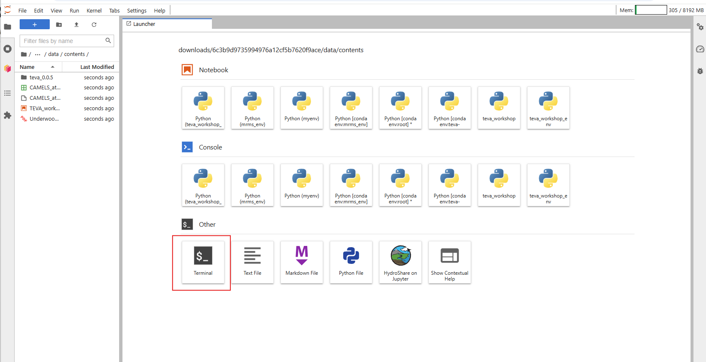
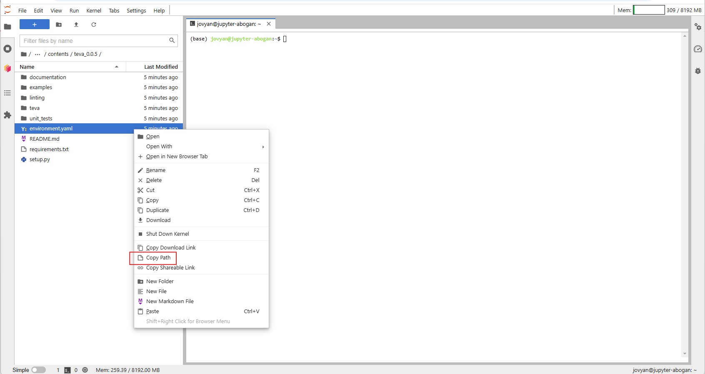
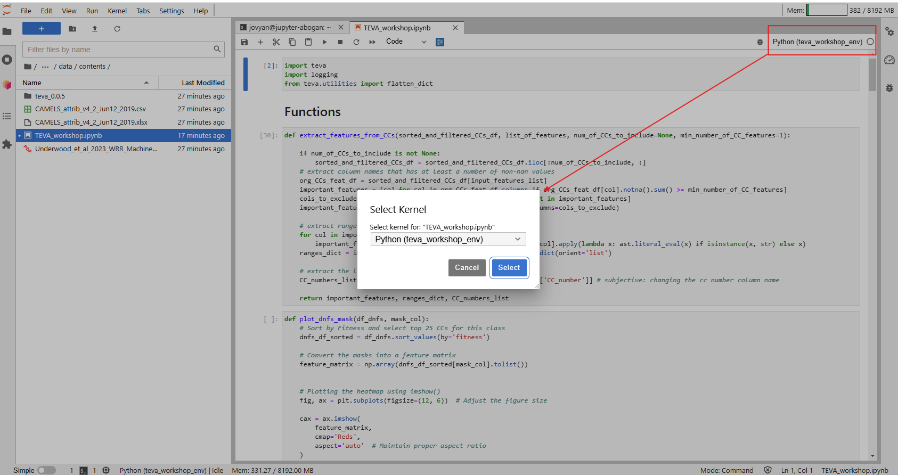

# teva-workshop-jupyterhub-env
Scratch repository with instructions for creating an environment in CUAHSI Jupyterhub for the [TEVA workshop](https://www.hydroshare.org/resource/6c3b9d9735994976a12cf5b7620f9ace/) given by the Big Data CZ cluster.

## Opening the terminal from within Juypterhub

Once the HydroShare resource has been opened with CUAHSI JupyterHub, open the terminal from the launcher.

## Locating the YAML file

Next, navigate to the the TEVA folder (`teva_0.0.5`) and copy the path of the `environment.yaml` file.

## Creating and activating the new Conda environment

The environment can be created by running the command `conda env create -f <insert path to environment.yaml file>` in the terminal (paste in the path to the YAML file that was just copied). This will load the packages required to run TEVA and the contents of the notebook for the workshop. The environment can be activated running the command `conda activate teva-workshop`, where `teva-workshop` is the environment name defined within Conda. 

## Installing Jupyter kernel from new Conda environment

To install a Jupyter kernel from this environment to run the TEVA workshop Jupyter notebook, run the following command: `python -m ipykernel install --user --name teva_workshop_env`. This will create a kernel called `teva_workshop_env` which was installed from the `teva-workshop` Conda environment.

## Selecting kernel for Jupyter notebook

To configure the kernel, open the TEVA workshop Jupyter notebook and select the `teva_workshop_env` kernel that was just previously installed.

**The TEVA workshop Jupyter notebook is now ready to be executed!**

